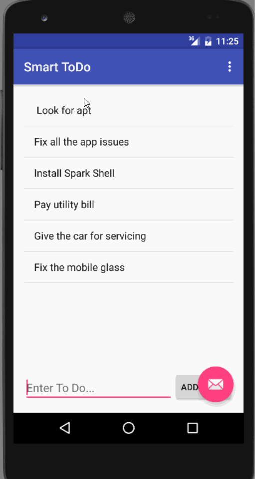

Smart Todo - Android App Demo

This application is created to manage todo actions and suppors the below mentioned features:

 * [x] Required: List all the todos.
 * [x] Required: Add the todo text: User has to enter the text and click on Add button in the bottom right corner
 * [x] Required: Edit the todo text: Click on the todo text, that opens up an edit activity page to modify the todo text and Save.
 * [x] Required: Delete the todo text: Long click on the item deletes the item.
 * [x] Required: Storing the state of the app in the file system.
 * [x] Optional: Validation on Add button.
	
Walk through of the functionality:

